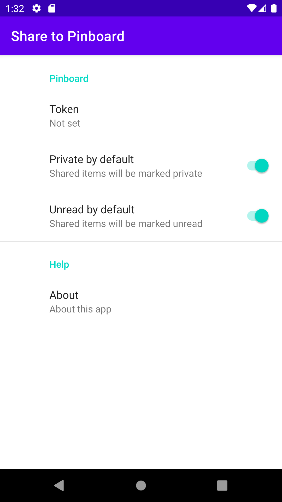

# Share to Pinboard

An app with a single purpose: to send URLs to [Pinboard][pinboard] without a fuss.

## Screenshots

## License

- The app is licensed under the [Apache License 2.0][apache].
- The app icon was generated from the stock Android Studio vector assets, licensed under the same
  terms.

[pinboard]: https://pinboard.in/

[apache]: https://www.apache.org/licenses/LICENSE-2.0.txt
